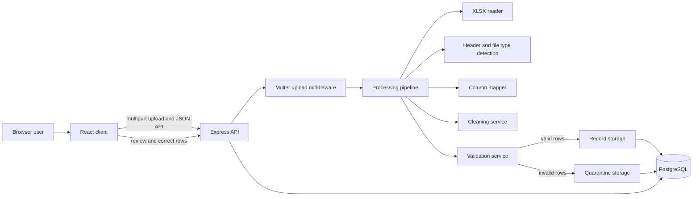
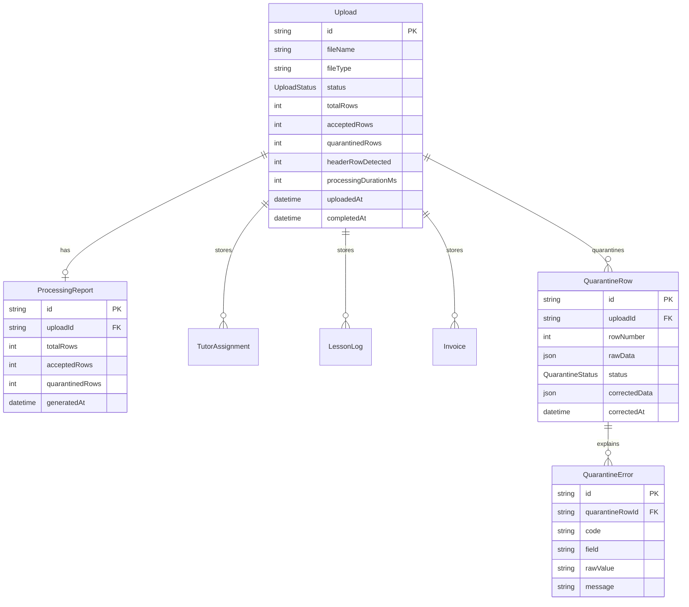

# Architecture

## System Diagram

## Pipeline Flow

1. `POST /api/upload` accepts `.xls` or `.xlsx` in multipart field `file`.
2. `multer` writes the workbook to `server/uploads`.
3. `readExcel` converts the first sheet into raw row arrays.
4. `detectHeaderRow` identifies a header row when the workbook has labels.
5. `detectFileType` classifies the workbook as `TUTOR_ASSIGNMENT`, `LESSON_LOG`, `INVOICE`, or `UNKNOWN`.
6. `mapRows` converts workbook columns into canonical domain fields.
7. `cleanRows` normalizes dates, currency, subjects, status-like values, text spacing, and numeric values.
8. `validateRows` separates valid rows from invalid rows and assigns reason codes.
9. `storeRecords` inserts valid rows into the file-type table.
10. `quarantineRows` stores invalid rows and field-level errors for correction.
11. `createProcessingReport` updates the upload status and stores accepted/quarantined counts.

## Validation Decisions

- Dates normalize to `YYYY-MM-DD` across ISO, slash, hyphen, month-name, two-digit-year, and Excel serial inputs. Invalid dates are quarantined with `INVALID_DATE`.
- Currency cleaning strips `SGD`, `$`, commas, and surrounding whitespace before numeric validation. Invalid currency cells are quarantined with `INVALID_AMOUNT`, `INVALID_FEE`, or `INVALID_RATE`.
- Invoice identity uses `invoiceNumber`. Every row participating in a duplicate is quarantined so the report does not silently accept one arbitrary copy.
- Lesson log identity uses `assignmentCode + lessonDate`. This catches repeated lessons without depending on optional notes.
- Tutor assignment identity uses `tutorName + studentName + startDate`. If the same identity appears with different rates, the rows are marked `NEAR_DUPLICATE`; if the rate is identical, they are marked `DUPLICATE_RECORD`.
- Unknown invoice payment statuses are quarantined as `UNKNOWN_STATUS`. This is stricter than passing through unrecognized values and keeps downstream reporting clean.
- The validator reports the original cell value in quarantine errors even when the cleaned canonical value is `null`. This makes correction screens actionable.

## ER Diagram

## Self-Critique

- The API currently returns `500` for some not-found upload lookups because service errors are collapsed in controllers. A production API should return `404` for missing resources.
- File processing is synchronous inside the upload request. This is acceptable for the assessment, but a queue would be safer for large workbooks.
- Uploaded files remain in `server/uploads`; cleanup or object storage would be needed for long-running deployments.
- Duplicate checks are upload-scoped service logic. Cross-upload duplicate detection would require database-backed uniqueness policy decisions.
- `quarentine` is misspelled in some filenames. The public route is correct (`/api/quarantine`), so renaming internals can be deferred to avoid churn.
